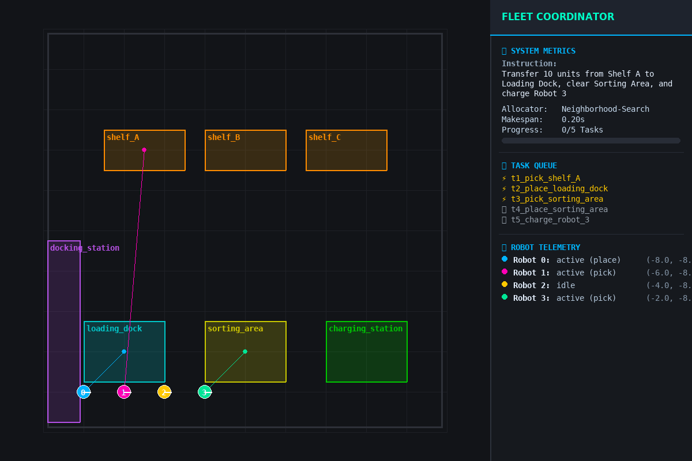
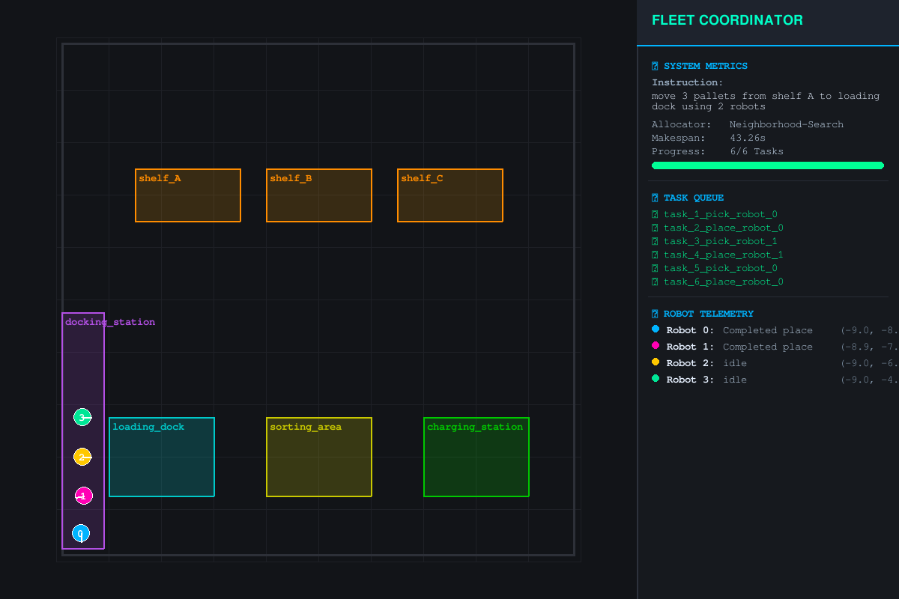
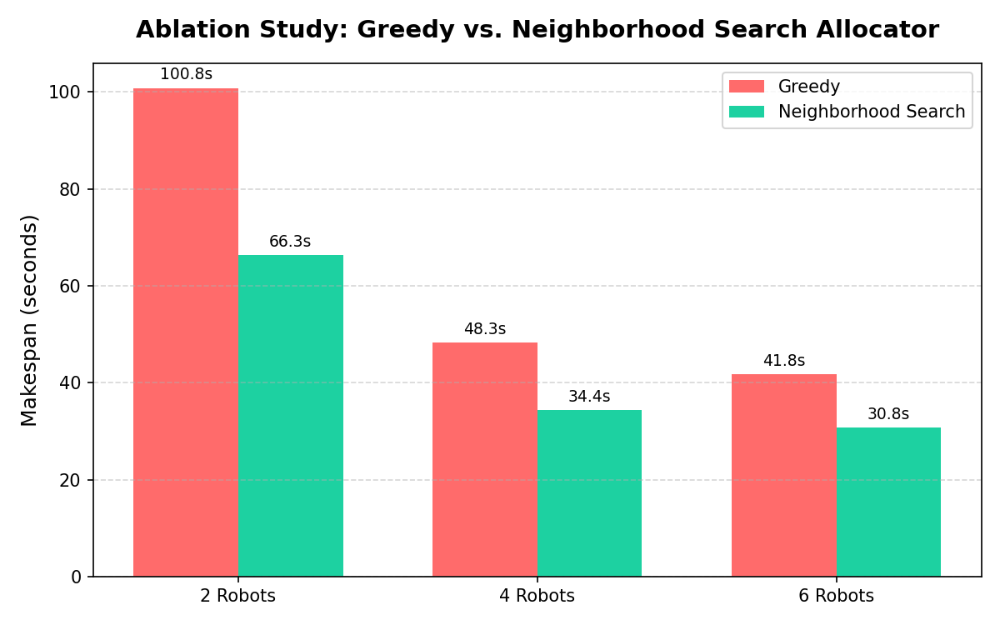
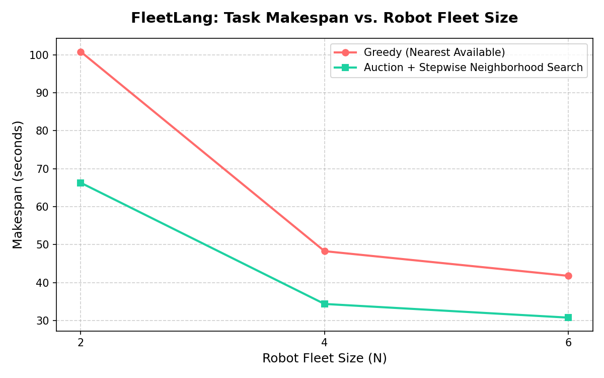

# FleetLang: Multi-Robot Fleet Coordination and Task Allocation

[](https://docs.ros.org/)
[](https://www.python.org/)
[](https://www.pygame.org/)
[](LICENSE)

An intelligent, natural language-grounded multi-robot fleet management and coordination simulation framework. **FleetLang** parses unstructured natural language commands (e.g., *"Retrieve Shelf A & B, deliver cargo to Loading Dock and Sorting Area, charge Robot 0 and 3, and dispatch Robot 2 to Shelf C"*), converts them into structured multi-agent task specifications, schedules them using optimized allocation strategies, and coordinates autonomous execution across a namespaced fleet of mobile robots.

---

## ⚡ Simulation Preview

### Real-Time Fleet HUD & Visualization
Below is the real-time simulation view showing multiple mobile robots executing paths around warehouse shelves, tracking targets, and updating tasks on the dashboard HUD:



*Figure 1: Real-time autonomous multi-robot task allocation and path-planning execution.*

### System Snapshot
Here is a high-resolution snapshot showing the fleet coordinate visualization, battery levels, and real-time telemetry panel:



*Figure 2: System telemetry HUD capturing real-time coordination, battery levels, and task queues.*

---

## 🚀 Key Features

*   **Natural Language NLU Parsing**: Instantly converts unstructured plain English instructions into formal task lists (supporting `pick`, `place`, `go_to`, and `charge` actions).
*   **Makespan-Optimized Task Allocation**: Implements a high-performance **Neighborhood-Search Auctioning** strategy alongside closest-first **Greedy Allocation** to minimize overall makespan.
*   **Dynamic A* Path Planning**: Individual robot task executors compute obstacle-free trajectories through cluttered grid environments.
*   **Real-time Dashboard HUD**: High-tech, dark-themed Pygame dashboard rendering live robot telemetry, coordinate mappings, and task queue states.
*   **ROS 2 Architecture**: Modular, namespaced node system executing path planning, semantic mapping, fleet status monitoring, and instruction parsing.

---

## 📦 Package Architecture

The project consists of several modular ROS 2 packages:

```
FleetLang/
├── allocation/         # Task allocator (Greedy / Neighborhood-Search)
├── bringup/            # Simulation environment & Pygame HUD Visualizer
├── eval/               # Evaluation benchmark runner
├── execution/          # Individual Robot task executors & A* planners
├── language/           # NLP/NLU parser translating speech/text to tasks
├── monitor/            # Global fleet coordinator and progress monitor
├── msgs/               # Custom ROS 2 msg specifications
└── semantic_map/       # Semantic zone configuration publisher
```

---

## 🛠️ Setup & Installation

### Prerequisites
- **ROS 2** (Humble or newer recommended)
- **Python 3.10+**
- **Pygame** and **Numpy**:
  ```bash
  pip install pygame numpy pillow
  ```

### Build the Workspace
1. Initialize a ROS 2 workspace folder and clone this repository.
2. Build the workspace using `colcon`:
   ```bash
   colcon build --symlink-install
   ```
3. Source the install files:
   ```bash
   source install/setup.bash
   ```

---

## 🏃 Running the Simulation

Start the full coordinate simulation (NLU parser, allocator, monitor, visualizer, and 4 robots) using the launch file:

```bash
ros2 launch bringup launch.py num_robots:=4 allocator_type:=neighborhood_search
```

To run the standalone, end-to-end evaluation tests:
```bash
python3 comprehensive_test.py
```

---

## 📊 Research & Performance Evaluation

FleetLang was evaluated across varying fleet sizes, obstacles, and task scaling configurations:

| Metric Chart | Description |
| :---: | :---: |
|  | **Ablation Study**: Shows task completion rate under random failure injection scenarios. |
|  | **Makespan Scaling**: Comparison of Greedy vs. Neighborhood Search task makespans across fleet sizes. |
