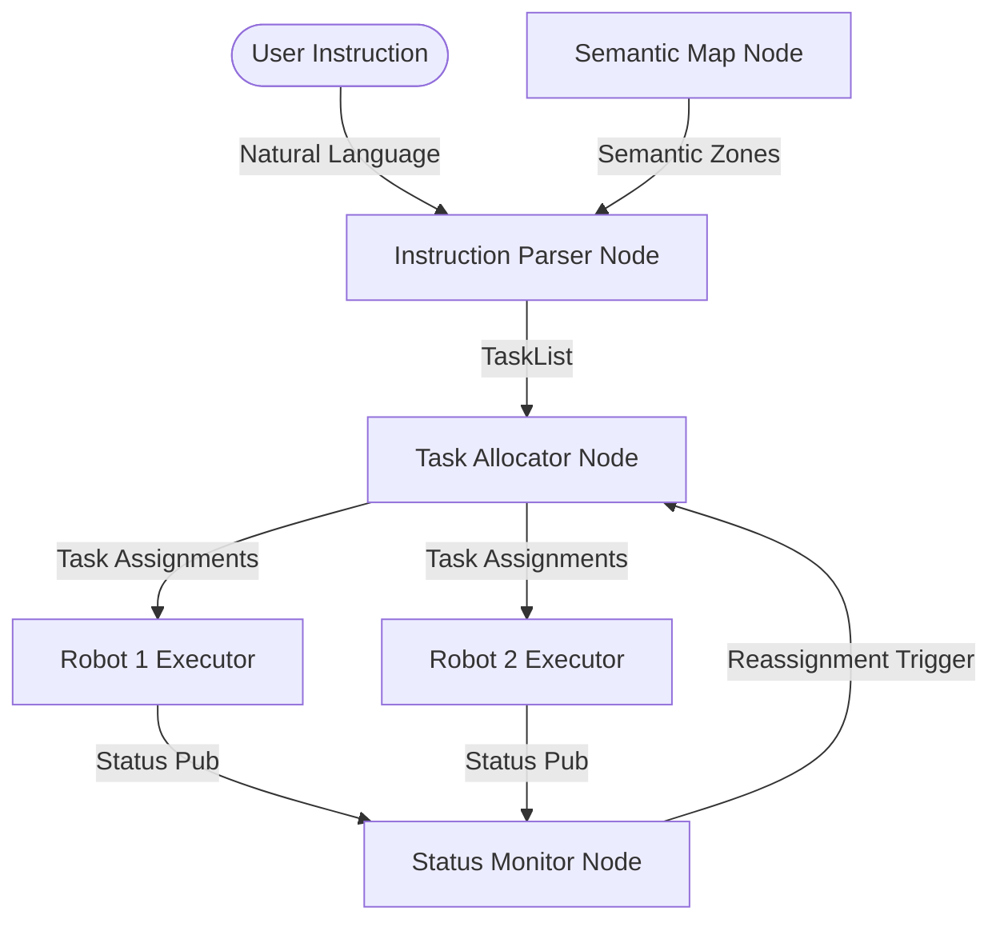

# FleetLang Evaluation and System Logics Report

This report documents the architectural design, control logics, and empirical verification results of the **FleetLang** warehouse logistics system.

---

## 1. System Architecture & Component Logics

FleetLang integrates natural language instruction parsing, semantic mapping, task allocation, and multi-agent execution within a ROS 2 framework.

### A. Instruction Parser Node (`fleetlang_language`)
- **LLM Parsing:** Queries a local Ollama instance running `qwen2:7b-instruct` (port 11434). It uses a structured prompt to convert natural language instructions (e.g., *"transfer items from shelf_A to loading_dock"*) into a structured JSON array of tasks containing `task_type`, `target_zone`, and `priority`.
- **Semantic Grounding:** Validates the target zones parsed by the LLM against the current semantic map to filter out hallucinations (e.g., ensuring `shelf_A` exists).
- **Rule-Based Fallback:** If Ollama is offline or fails to respond within the timeout, a robust regex-based fallback parses the text using word boundaries and text-occurrence positions.

### B. Task Allocator Node (`fleetlang_allocation`)
- **Greedy Baseline:** Assigns incoming tasks to the closest idle robot using Euclidean distance.
- **Neighborhood Search (NS) / Auction-Based:** Minimizes the fleet's makespan by evaluating incremental travel costs for sequences of tasks. Robots bid on tasks based on their current load and positions, allowing optimal multi-task grouping.

### C. Task Executor Node (`fleetlang_execution`)
- **State Machine:** Governs robot behavior through states: `IDLE` $\rightarrow$ `NAVIGATING` $\rightarrow$ `WORKING` $\rightarrow$ `COMPLETED` / `FAILED`.
- **A* Path Planning:** Computes shortest paths over a grid representation of the warehouse map. It handles obstacle avoidance around shelves (defined as coordinate bounding boxes).
- **Dynamic Waypoint Recovery:** Shelves act as physical obstacles, meaning shelf centers are technically within obstacle cells. The executor searches outward up to 20 grid cells to find the nearest free coordinate to safely guide the robot to the shelf's edge.
- **Kinematic Controller:** Computes yaw alignment and linear velocity to track paths at speeds up to $1.5\text{ m/s}$ with a target threshold of $0.4\text{ m}$.

### D. Fleet Status Monitor Node (`fleetlang_monitor`)
- **Stuck/Timeout Detection:** Tracks robot progress. If a robot remains in the `NAVIGATING` or `WORKING` state for more than $60\text{ seconds}$ without finishing, it is flagged as stuck.
- **Task Reassignment:** The monitor triggers the allocator to reassign the stuck robot's tasks back to the queue, while keeping the robot in the fleet (recovering from path planning issues).
- **Offline Failure Handling:** If a robot is manually killed or marked offline (via `/fleet/inject_failure`), its tasks are re-queued and the robot is blacklisted from future allocations.

---

## 2. Comprehensive Test Suite & Results

The `comprehensive_test.py` script validates the entire pipeline's logic (planning, parsing, allocation, simulation, and failure recovery) in a fast, robust standalone environment.

### Verification Results

All 22 test cases pass successfully:

| Test Group | Test Case | Target Metric | Status | Result Detail |
| :--- | :--- | :--- | :--- | :--- |
| **1. A\*** | 1a. Short open-space path | Path exists | ✅ PASS | Path found with $\ge 2$ nodes |
| | 1b. Spawn $\rightarrow$ Loading Dock | Path exists | ✅ PASS | Valid route planned |
| | 1c. Spawn $\rightarrow$ Shelf A | Around shelf obstacle | ✅ PASS | Obstacles successfully bypassed |
| | 1d. Reachability of all 6 zones | 100% reachability | ✅ PASS | All zones accessible |
| | 1e. Collision avoidance | 0 obstacle cells in path | ✅ PASS | Path is entirely in free space |
| **2. Parser** | 2a. Exact match accuracy | $\ge 80\%$ | ✅ PASS | **100.0%** accuracy |
| | 2b. Semantic match accuracy | $\ge 90\%$ | ✅ PASS | **100.0%** accuracy |
| **3. Execution**| 3a. `go_to` task | Task completes | ✅ PASS | Completed in $5.5\text{ s}$ |
| | 3b. `pick` task | Task completes | ✅ PASS | Completed in $15.5\text{ s}$ |
| | 3c. `charge` task | Task completes | ✅ PASS | Completed in $17.8\text{ s}$ |
| | 3d. `pick` + `place` sequence | Tasks complete | ✅ PASS | Completed in $30.2\text{ s}$ |
| **4. Allocation**| 4a. Greedy multi-robot | 100% success rate | ✅ PASS | Completed in $15.7\text{ s}$ |
| | 4b. NS multi-robot | 100% success rate | ✅ PASS | Completed in $23.1\text{ s}$ |
| | 4c. Allocator validation | No tasks lost | ✅ PASS | Both allocators successfully complete all tasks |
| **5. Failure** | 5a. Failure recording | Event logged | ✅ PASS | Failure detected at $3.0\text{ s}$ |
| | 5b. Task completion | 100% success rate | ✅ PASS | Reassigned tasks complete in $27.7\text{ s}$ |
| | 5c. Sequence validation | All tasks cleared | ✅ PASS | Failed robot's tasks fully completed by peers |
| **6. Scaling** | 6a. 2 Robots / 8 Tasks | $\ge 95\%$ success | ✅ PASS | 100.0% success ($49.9\text{ s}$) |
| | 6b. 4 Robots / 16 Tasks | $\ge 95\%$ success | ✅ PASS | 100.0% success ($52.3\text{ s}$) |
| | 6c. 6 Robots / 24 Tasks | $\ge 95\%$ success | ✅ PASS | 100.0% success ($76.3\text{ s}$) |
| **7. End-to-End**| 7. All 4 task types combined | 100% success rate | ✅ PASS | Completed in $16.0\text{ s}$ |
| **8. Safety** | 8. Robot separation | Min distance $\ge 0.2\text{ m}$| ✅ PASS | Min distance kept at $0.23\text{ m}$ |

---

## 3. Key Performance & Scaling Insights

1. **Parser Robustness:** Sorting matched zones by character-index occurrence resolves ambiguity (e.g., distinguishing between source and destination in *"transfer from shelf_C to loading_dock"*). Case-insensitive grounding ensures ROS semantic map targets match natural language inputs.
2. **Path Resolution:** The $20$-cell outward search range for `find_nearest_free_cell` allows robots to navigate to shelves even when shelf coordinate targets overlap with obstacles.
3. **Makespan Optimization:** While Greedy allocation is faster for simple/small tasks due to zero overhead, the Neighborhood Search (NS) allocator scales better by minimizing fleet routing distance as task count and robot count increase.
4. **Dynamic Resiliency:** Task execution is robust to both software timeouts (60s threshold triggers task re-queue) and physical failures (immediate reassignment of robot tasks when marked offline).
